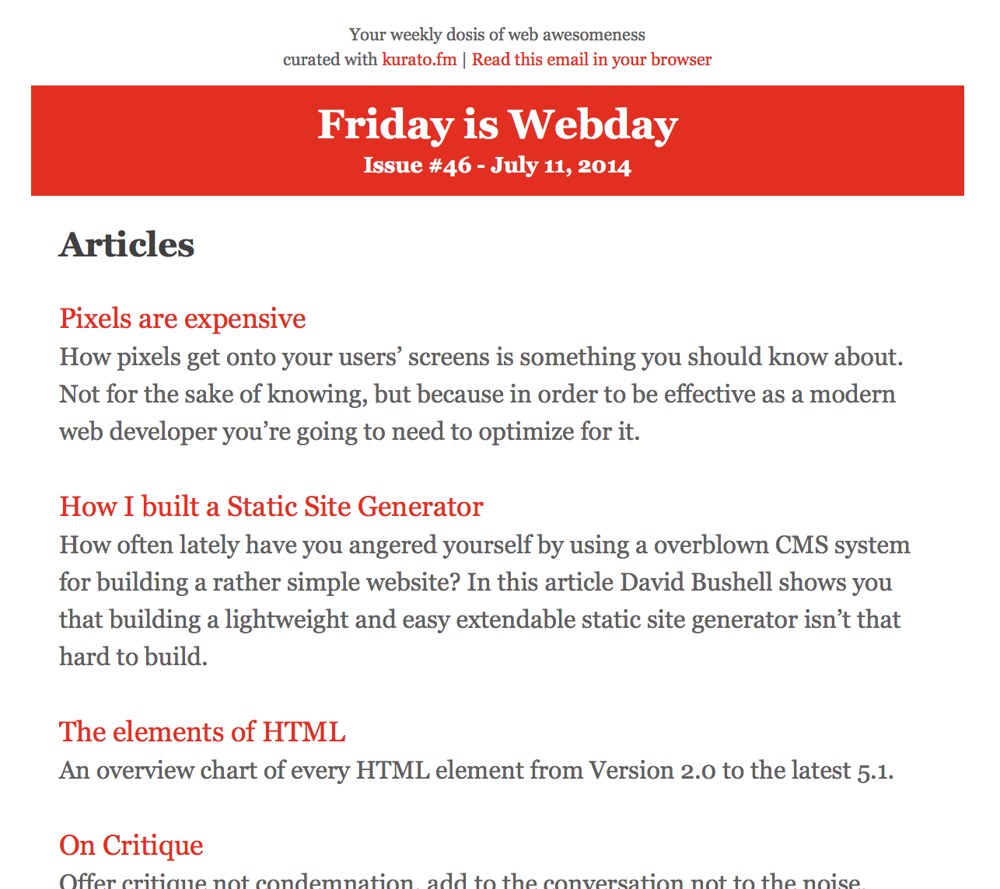

# Friday is Webday Mailchimp Template

A 1 column mailchimp email template for my weekly [Friday is Webday](http://danielpuglisi.com/fridayiswebday) newsletter.

## Usage

It's a link/list heavy (4+ lists with 15+ links) newsletter and the template is optimized to beautify and make the lists more readable.

To apply the list styling add the `.issue-link-list` class to an `ul` element and you're good to go.

## More

Feel free to fork, modify and do what you want with it.

Oh, and check out my side project [kurato.fm](http://kurato.fm). I use it for creating Friday is Webday.
